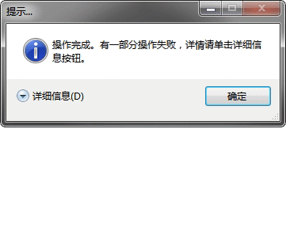
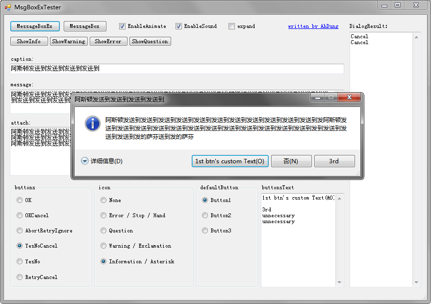

# MessageBoxEx
可携带附加消息的增强型消息框

## 2018-06-09更新至2.0
**新特性：**
- 允许自定义按钮文本
- 允许详细信息呈展开状态弹出
- 增加典型消息框（信息、警告、错误、询问）调用重载`ShowInfo` `ShowWarning` `ShowError` `ShowQuestion`

**变更：**
- 用默认参数替代过多`Show`重载
- 大量重写消息窗体。控件由之前的预创建改为按需创建，大量降低无谓消耗
- 项目更新至VS2017
- 配合新特性更新Tester，如图：

